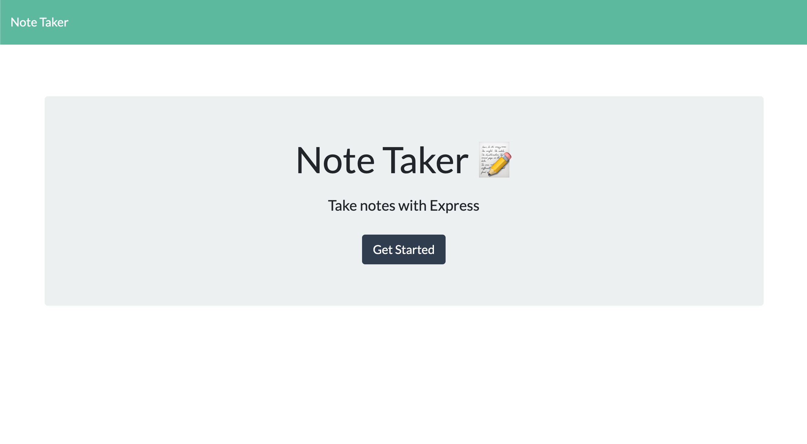
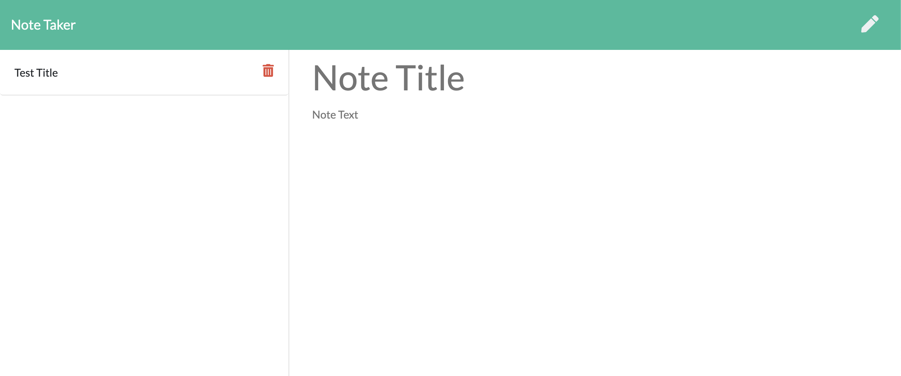
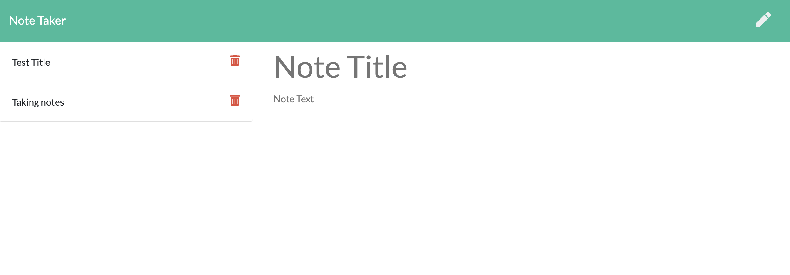
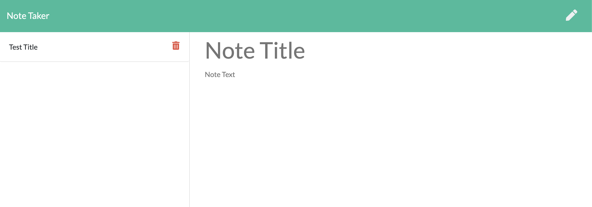

# Note Taker 
 This is a server hosted note taking web application. You can save, review, and delete your notes as well. 

 ## Deployed Link
  https://note-taker78745.herokuapp.com/

 ## Table of Contents  
 * [Instructions for Use](#Instructions-for-Use) ) 
 * [Questions](#Questions) 
 * [License](#License) 
 ## Instructions for Use 
  Load the url in your browser and select Get Started.
  
  Once you've loaded the note take page, add your note title and then begin taking your notes.
  
  When your notes are complete, you can click the "Save" button in the top right corner. After it's saved, refresh the page and see it saved on the left hand side of the screen.
  
  To review a note, click the title in the notes column and the title and paragraph text will appear on the screen.
  To delete a note, click the "Trash can" icon, and then refresh the page and see it removed from the Notes column.
  
 ## Questions  
 * Github Username: ashlinhanson 
 * Email: ashlinhanson@gmail.com 
 * How to contact: Contact via email  
 ## License   
 Copyright (c) 2020 Ashli Hanson Licensed under the MIT license.